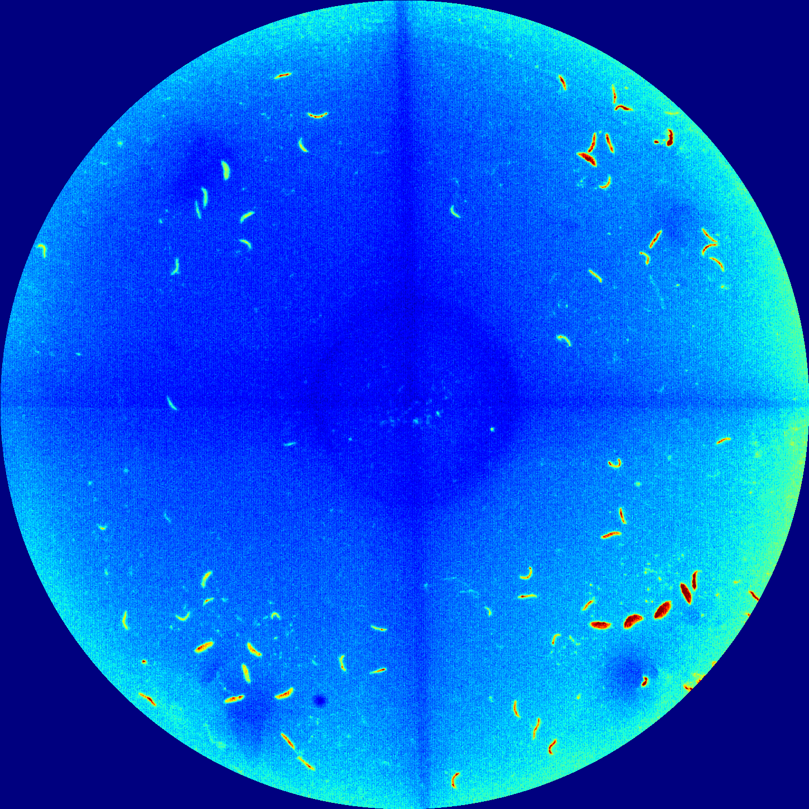
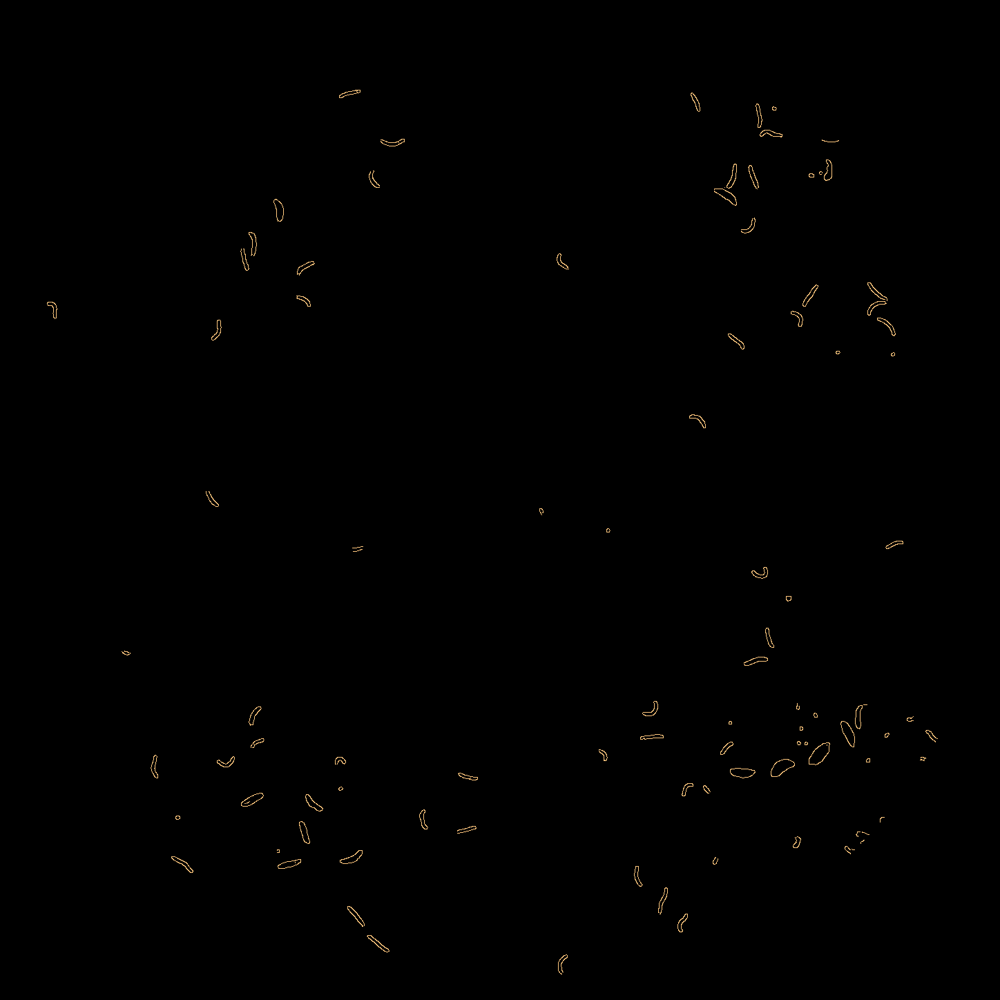
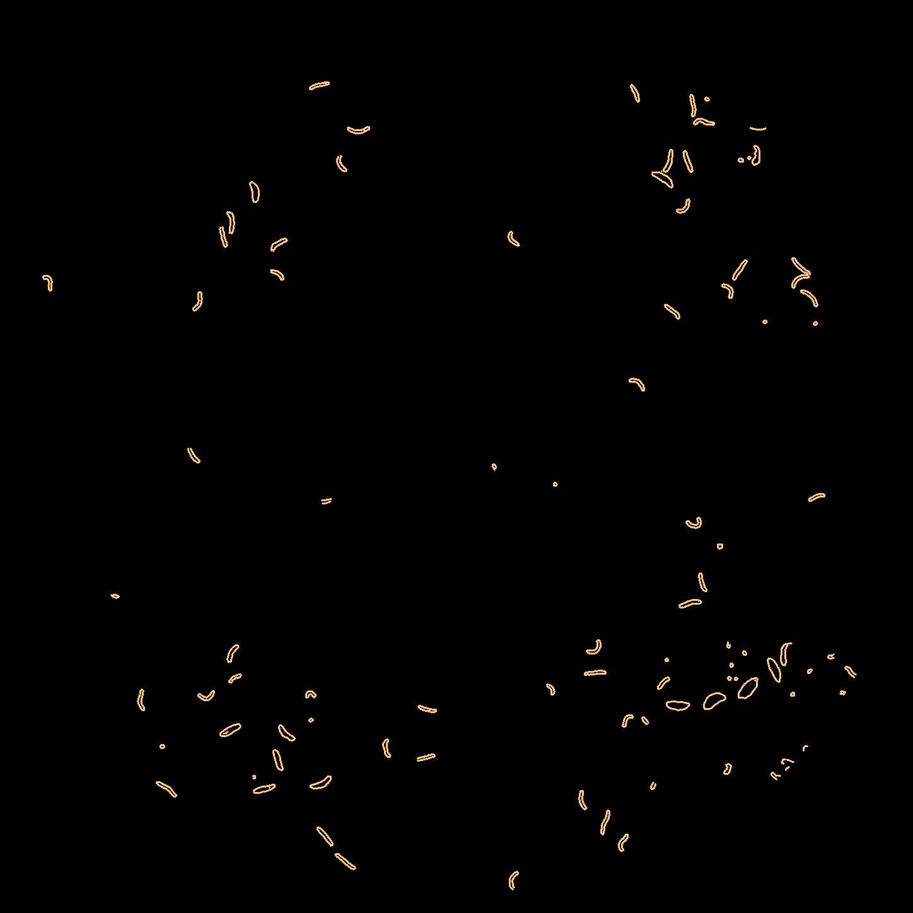
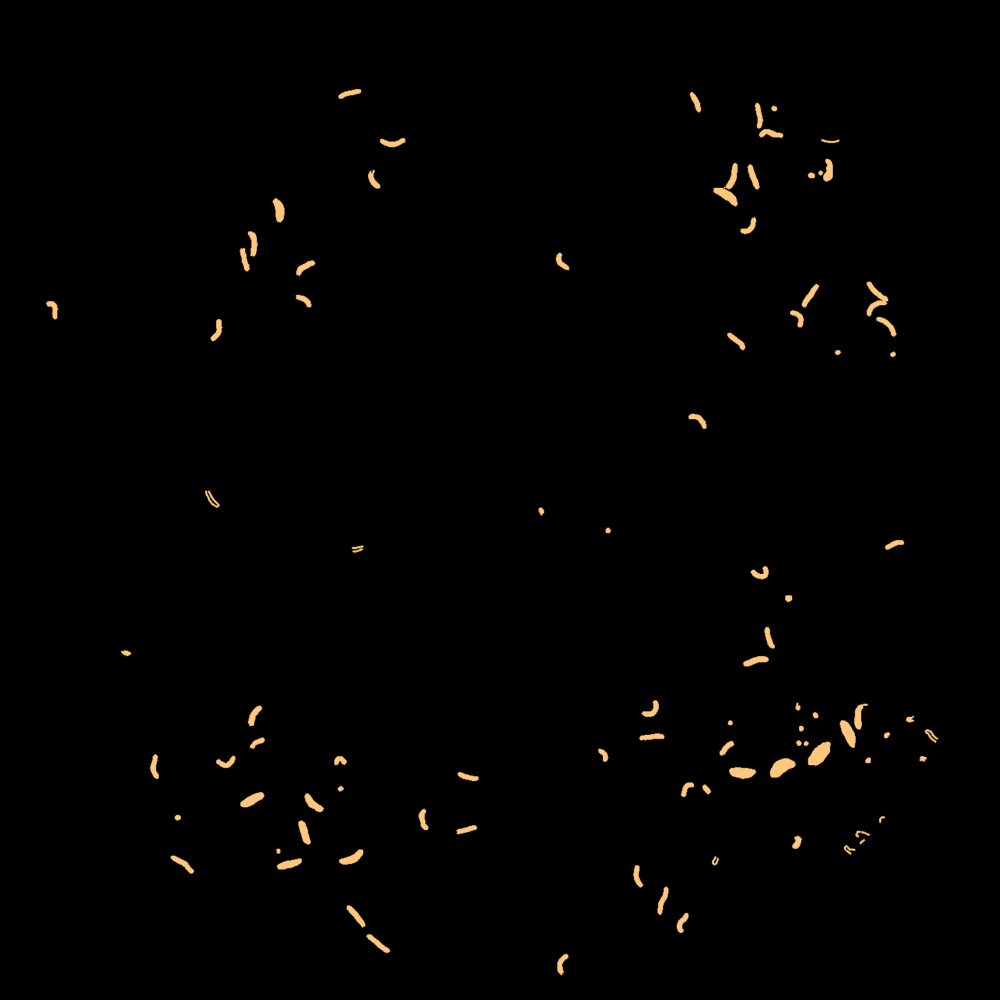

 

# chemotaxis-cli

A command-line program for calculating the chemotaxis index of a plate (CI).

### Original

### Crop

### Mask

### Edge detection

### Edge dilation

### Binary Fill

### Filter small particles

